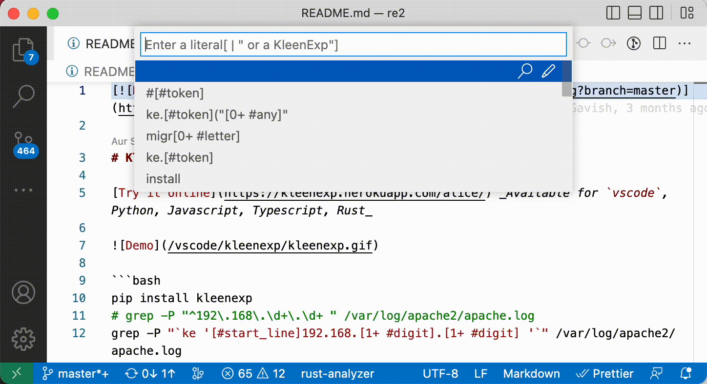

# kleenexp

Enables the [Kleenexp](https://github.com/SonOfLilit/kleenexp) modern Regular Expression syntax for Search and Replace in Visual Studio Code.

## Features

By default, keybindings for Find, Find in Files, etc' are overriden by this extension, and show a popup menu where you can enter a KleenExp. Upon selecting a KleenExp, it will be compiled to legacy regex and the standard dialog will open with that regex:



> In the future we intend to integrate seamlessly with the vscode Find dialog. However, this will require some patches to vscode itself, since an API for this does not exist yet, so for the alpha version, there's an input popup. It has history with search-as-you-type and is quite ergonomic overall.

## Requirements

You must have the `kleenexp` python package installed:

```
$ pip install kleenexp
```

If it's installed in a non-standard location, you will need to configure the `kleenexp.kePath` setting.

## Known Issues

This is alpha-level software. There will be many issues. Please report them on our [github](https://github.com/SonOfLilit/kleenexp). That being said, it's already pretty awesome to work with.

## Release Notes

### 0.0.1

Initial release
